# Architectural Inventory & Baseline Audit: `behavioral-playwright`

**Date:** September 2026  
**Auditor:** Engineering Agent (Enterprise Governance)  
**Target Repository:** `behavioral-playwright` v10.0.0  
**Status:** Baseline Audit Completed  

---

## 1. Executive Summary

This document establishes the official architectural inventory, directory topology, module responsibilities, and baseline anti-pattern audit for the `behavioral-playwright` web automation and scraping framework. 

The framework is an AI-native browser automation, stealth execution, and scraping engine designed to provide high-level abstractions over Playwright with multi-engine provider bridging, biomechanical input synthesis, and self-healing selector resolution. This baseline audit assesses the current codebase against our 90-day enterprise codex standards.

---

## 2. Codebase Topology & Directory Structure

```text
E:\Behavioural\
├── .agents/                                # Enterprise Governance & Skill Definitions
│   └── skills/
│       ├── browser-automation/SKILL.md     # 50 Master Guardrails for Automation
│       └── fastapi-production/SKILL.md     # 90-Day Backend Reference Codex
├── .cursorrules                            # IDE Multi-Skill Routing Matrix
├── AGENT.md / AGENTS.md                    # Core Invariants & Agent Directives
├── pyproject.toml                          # Build Manifest & Tool Configurations
├── README.md                               # Framework Documentation
├── antiscraper.py                          # Standalone Quick Scraper Script
├── behavioral_evasion_ten_patches_hardened_v15.py  # V15 10-Layer Hardened Evasion
├── bp_biomechanical_engine-v23.py          # V23 Biomechanical Movement Engine
├── itch_binary.py                          # High-Speed ITCH 5.0 Protocol Parser
├── providers/                              # Root Multi-Engine Adapter Package
│   ├── agents.py                           # BrowserUse, Stagehand, Crawl4ai Adapters
│   ├── base.py                             # Provider Base Protocol & Detection
│   ├── browser.py                          # Playwright, Patchright, Undetected Chrome
│   ├── factory.py                          # Dynamic Provider Factory
│   └── network.py                          # CurlImpersonate, TlsClient Adapters
├── scripts/                                # Quality Assurance & Verification Scripts
│   ├── audit_architecture.py               # AST Architecture Compliance Linter
│   ├── run_benchmarks.py                   # Performance Profiling & Latency SLAs
│   ├── run_ci_locally.sh                   # 6-Stage CI Pipeline Runner
│   ├── run_crawlers.sh                     # Crawler Quality Gate Runner
│   └── run_graduation_audit.sh             # Full Graduation Audit Runner
├── src/behavioral_playwright/              # Core Source Package
│   ├── __init__.py                         # Package Root & Exports
│   ├── facade.py                           # Unified `BP` Facade Class
│   ├── _legacy_facade12.py                 # Monolithic Legacy Facade Reference
│   ├── exceptions.py                       # Unified Exception Hierarchy
│   ├── logging.py                          # Centralized Logging & Telemetry Handlers
│   ├── api/                                # Direct HTTP Transport Layer
│   │   └── client.py                       # Asynchronous REST/HTTP Client
│   ├── automation/                         # Biomechanical Input Synthesis
│   │   ├── keyboard.py                     # Humanized Keystroke Timing
│   │   ├── mouse.py                        # Bézier Curve Mouse Trajectories
│   │   └── scroll.py                       # Micro-Jitter Humanized Scrolling
│   ├── browser/                            # Browser Lifecycle & Engine Drivers
│   │   ├── actions.py                      # Core Browser Navigation & Actions
│   │   ├── base.py                         # Abstract Browser Provider Interface
│   │   ├── mock_provider.py                # In-Memory Deterministic Mock Driver
│   │   └── playwright_provider.py          # Real Playwright Persistent Context Driver
│   ├── cli/                                # Command Line Entrypoint
│   │   └── main.py                         # CLI Commands & Sub-commands
│   ├── config/                             # Configuration Schemas
│   │   └── settings.py                     # Dataclass-based Configuration Models
│   ├── core/                               # Core Internal Engines
│   │   ├── engine_v15.py                   # Hardened 10-Patch Core Engine
│   │   └── itch_binary.py                  # Struct-Unpacked ITCH Protocol Streamer
│   ├── crawling/                           # Web Crawling Infrastructure
│   │   ├── crawler.py                      # High-Level Crawler Class
│   │   └── service.py                      # SQLite-Backed Stateful Crawler Service
│   ├── document/                           # Document & OCR Processing
│   │   └── ocr.py                          # Optical Character Recognition Engine
│   ├── extraction/                         # Structured DOM Extraction
│   │   └── dom.py                          # Table, Link & Metadata Extractors
│   ├── fingerprint/                        # Device Fingerprint Synthesis
│   │   ├── generator.py                    # Procedural Fingerprint Generator
│   │   ├── models.py                       # Fingerprint Dataclass Models
│   │   └── profiles.py                     # Pre-compiled Realistic Hardware Profiles
│   ├── handoff/                            # Session Handoff & Human-in-the-Loop
│   │   └── session_handoff.py              # CLI & Cookie Dump Handoff Handlers
│   ├── integrations/                       # Extension & Addon Support
│   │   └── extensions.py                   # Chrome Extension Loader
│   ├── mapping/                            # DOM Tree Mapping
│   │   └── mapper.py                       # Compact Accessibility Tree Generator
│   ├── mcp/                                # Model Context Protocol (MCP) Integration
│   │   ├── server.py                       # Standard MCP JSON-RPC Server
│   │   └── tools.py                        # Exposable MCP Tool Declarations
│   ├── models/                             # Shared Domain Data Models
│   │   ├── elements.py                     # DOMElement, BoundingBox Dataclasses
│   │   └── results.py                      # ResolutionResult, ExtractionRecord Models
│   ├── observability/                      # Metrics, Telemetry & Logging
│   │   └── metrics.py                      # Operation Timers & Counter Collectors
│   ├── page/                               # Page-Level Session Encapsulation
│   │   └── session.py                      # Managed Page & Frame Lifecycle Session
│   ├── powerplay/                          # Mathematical Stealth & Anomaly Defense
│   │   ├── biomechanics.py                 # Fitts' Law Motor Kinetics
│   │   ├── captcha.py                      # Poisson CDF CAPTCHA Loop Risk Evaluator
│   │   ├── keystrokes.py                   # Digraph Cognitive Latency Model
│   │   ├── memory_pid.py                   # Process Memory PID Scrubber
│   │   ├── network_l4.py                   # Layer 4 TCP/IP Frame Masking
│   │   ├── orchestrator.py                 # Coordinated Stealth Orchestrator
│   │   ├── os_bridge.py                    # Platform-Specific OS Fingerprint Bridge
│   │   ├── schema_guard.py                 # O(N) Shannon Entropy Information Auditor
│   │   ├── tracking.py                     # Beacon & Telemetry Nullifier
│   │   └── vision_guard.py                 # Visual Element Occlusion & Viewport Guard
│   ├── providers/                          # Internal Mirror of Multi-Engine Adapters
│   │   ├── agents.py                       # AI Agent Framework Bridges
│   │   ├── base.py                         # Capability Detection & Base Classes
│   │   ├── browser.py                      # Third-Party Automation Drivers
│   │   ├── factory.py                      # Provider Instantiation Hub
│   │   └── network.py                      # TLS Fingerprint Network Drivers
│   ├── proxy/                              # Proxy Infrastructure
│   │   ├── models.py                       # Proxy Protocol & Metadata Dataclasses
│   │   └── pool.py                         # Weighted Round-Robin Proxy Pool Manager
│   ├── resilience/                         # Fault Tolerance & Recovery
│   │   ├── circuit_breaker.py              # 3-State FSM Circuit Breaker
│   │   ├── retry.py                        # Exponential Backoff Retry Policy
│   │   └── state.py                        # Failure State Persistence
│   ├── search/                             # Search Engine Automation
│   │   └── engine.py                       # Query & Result Scraper
│   ├── selectors/                          # Multi-Tier Self-Healing Selector Engine
│   │   ├── fuzzy.py                        # L3 Fuzzy Levenshtein Distance Matcher
│   │   ├── resolver.py                     # Cascading L1 -> L2 -> L3 Resolver Engine
│   │   ├── semantic.py                     # L2 Semantic & ARIA Accessibility Matcher
│   │   └── strategies.py                   # Strategy Pattern Protocols
│   ├── storage/                            # Multi-Format Data Exporters
│   │   ├── base.py                         # Storage Exporter Protocol
│   │   └── exporters.py                    # JSON, CSV, SQLite, Parquet Writers
│   └── verification/                       # Assertion & Integrity Checkers
│       └── verifier.py                     # Visual & DOM Assertion Verifier
└── tests/                                  # Automated Test Suite (181+ tests)
    ├── test_baseline_protection.py
    ├── test_facade.py
    ├── test_facade_real.py
    ├── test_honesty_hardening.py
    ├── test_itch_binary.py
    ├── test_powerplay.py
    ├── test_providers.py
    ├── test_v23_quarantine.py
    ├── integration/
    └── unit/
```

---

## 3. Core Architecture Layers & Dependency Flow

```mermaid
graph TD
    UserApp["Client Application / Scraper Script"] --> BP["Unified Facade (BP)"]
    
    subgraph "Perimeter & Orchestration Layer"
        BP --> Actions["Browser Actions (browser/actions.py)"]
        BP --> CrawlSvc["Crawler Service (crawling/service.py)"]
        BP --> Extractor["DOM Extractor (extraction/dom.py)"]
    end

    subgraph "Resilience & Proxy Layer"
        Actions --> CB["Circuit Breaker (resilience/circuit_breaker.py)"]
        Actions --> Retry["Retry Policy (resilience/retry.py)"]
        Actions --> ProxyPool["Proxy Pool (proxy/pool.py)"]
    end

    subgraph "Engine & Lifecycle Layer"
        Actions --> Provider["Browser Provider (browser/playwright_provider.py)"]
        Provider --> NativeDriver["Playwright Native (Chromium)"]
        BP --> MultiProvider["Multi-Engine Adapters (providers/)"]
        MultiProvider --> Patchright["Patchright / Undetected-Chrome"]
    end

    subgraph "Stealth & Biomechanics Layer"
        Actions --> PowerPlay["PowerPlay Subsystem (powerplay/)"]
        PowerPlay --> Biomech["Mouse / Keyboard / Scroll (automation/)"]
        PowerPlay --> Entropy["Shannon Entropy Guard (schema_guard.py)"]
        PowerPlay --> CaptchaFSM["Poisson Loop Detector (captcha.py)"]
    end

    subgraph "Selector & Resolution Layer"
        Actions --> Resolver["SelfHealingResolver (selectors/resolver.py)"]
        Resolver --> L1["L1: Exact CSS Match"]
        Resolver --> L2["L2: Semantic ARIA (selectors/semantic.py)"]
        Resolver --> L3["L3: Fuzzy Levenshtein (selectors/fuzzy.py)"]
    end

    subgraph "Persistence & Storage Layer"
        CrawlSvc --> CrawlDB["SQLite Crawl State (crawl_urls)"]
        Extractor --> Exporters["Storage Exporters (storage/exporters.py)"]
        Exporters --> Disk["JSON / CSV / Parquet / SQLite"]
    end
```



---

## 4. Architecture & Anti-Pattern Audit

Evaluating the existing codebase against the 50 Master Guardrails reveals critical real-world contrasts:

### 4.1 Memory & Process Leaks
* **CRITICAL VULNERABILITY (Identified in `antiscraper.py:151-198`)**:
  - `antiscraper.py` launches a brand-new persistent browser context executable (`pw.chromium.launch_persistent_context`) on every single scrape invocation (`pw, context, page, profile_dir = await self._launch()`). Spawning an OS browser process per request consumes 150MB+ RAM and requires 1500–3000ms latency.
  - While `context.close()` is called in `finally:`, high concurrency will spawn dozens of parallel Chromium executables, overwhelming system resources.
* **VERIFIED GOOD PATTERN (Identified in `src/behavioral_playwright/browser/playwright_provider.py:76-90`)**:
  - The provider encapsulates context teardown cleanly in `close()`, closing `self._context`, stopping `self._playwright`, wiping temporary profile directories, and resetting all pointers to `None`.
* **ARCHITECTURAL RECOMMENDATION**: Implement the Single Browser Multi-Context Pool (`BrowserPoolManager`) mandated in Guardrail 11 to pool lightweight contexts instead of launching fresh browser processes.

### 4.2 Timing Traps & Static Sleep Violations
* **CRITICAL VULNERABILITY (Identified in `src/behavioral_playwright/_legacy_facade12.py:600`)**:
  ```python
  # Line 600: Synchronous time.sleep freezing the asyncio event loop!
  time.sleep(sleep_time)
  ```
  Calling synchronous `time.sleep()` in an async codebase freezes the entire Python process event loop, stalling all concurrent scraper tasks.
* **CRITICAL VULNERABILITY (Identified in `antiscraper.py:135, 160, 171`)**:
  ```python
  # Line 135: Arbitrary sleep inside Cloudflare polling
  await asyncio.sleep(1)
  # Line 160: Magic static sleep post-navigation
  await asyncio.sleep(1.5)
  # Line 171: Hardcoded 5-second blind pause after pressing Enter!
  await asyncio.sleep(5)
  ```
  These static magic numbers violate Guardrail 21 (Strict Ban on Arbitrary Sleeping). They are inherently flaky on slow networks and waste seconds on fast ones.
* **MODERATE VULNERABILITY (Identified in `src/behavioral_playwright/crawling/service.py:245`)**:
  ```python
  # Line 245: Linear rate limiting via naive sleep
  await asyncio.sleep(60.0 / self.rate_limit_rpm)
  ```
  Sleep-based throttling causes drift under varying network latency. It should be upgraded to an asynchronous Token Bucket rate limiter.

### 4.3 Selector Fragility & Self-Healing Integrity
* **VERIFIED GOOD PATTERN (Identified in `src/behavioral_playwright/selectors/resolver.py:134-210`)**:
  - `SelfHealingResolver` implements a sophisticated 3-tier cascade: L1 Exact Match $\to$ L2 Semantic Accessibility Recovery $\to$ L3 Fuzzy Levenshtein Distance.
  - Captures live interactive DOM nodes as lightweight `DOMElement` objects, scoring candidates by tag, ARIA role, and text content.
  - Zero fragile absolute XPaths in the resolver engine.
* **CRITICAL VULNERABILITY (Identified in `antiscraper.py:218`)**:
  ```javascript
  // Line 218: Loose substring class matching with no test-id or semantic hierarchy
  const cards = document.querySelectorAll('.cus-col, .product-box, .product-card, .grid-item, div.card, div[class*="col-"]');
  ```
  Matching `div[class*="col-"]` matches unrelated grid layout wrappers (headers, sidebars, footers), polluting scraped results with invalid data.

### 4.4 Error & Rate-Limit Handling
* **VERIFIED GOOD PATTERN (Identified in `src/behavioral_playwright/resilience/circuit_breaker.py:23-105`)**:
  - Production-grade Three-State Finite State Machine (`CLOSED`, `OPEN`, `HALF_OPEN`).
  - Supports injectable `clock_fn` for deterministic unit testing without sleeping.
  - Transitions to `OPEN` after `failure_threshold` consecutive errors, failing fast to prevent proxy burning and resource exhaustion.
* **VERIFIED GOOD PATTERN (Identified in `src/behavioral_playwright/powerplay/captcha.py:8-63`)**:
  - `ResolvedCAPTCHAInfiniteLoopDetector` applies Cumulative Poisson CDF and escalating lambda to detect recursive Cloudflare Turnstile loops and trigger proactive proxy rotation.
* **CRITICAL VULNERABILITY (Identified in `antiscraper.py:112-115, 132-133, 194-196`)**:
  ```python
  # Lines 114, 133: Bare except: pass swallowing exceptions
  try:
      await page.bring_to_front()
  except Exception:
      pass
  
  # Lines 194-196: Swallowing extraction error and returning empty list
  except Exception as e:
      logger.error(f"[!] Scrape error: {e}", exc_info=True)
  # Returns results = [] without re-raising or domain exception wrapping
  ```
  Violates Guardrail 11 (Zero Silent Exception Swallowing).

### 4.5 Data Validation & Typing Invariants
* **CRITICAL VULNERABILITY (Identified in `src/behavioral_playwright/models/results.py:39-45`)**:
  ```python
  @dataclass
  class ExtractionRecord:
      text: str
      href: Optional[str] = None
      attributes: Dict[str, Any] = field(default_factory=dict)
      metadata: Dict[str, Any] = field(default_factory=dict)
  ```
  The core extraction record is a standard unconstrained `@dataclass` holding untyped `Dict[str, Any]`. It lacks Pydantic validation, regex enforcement, numeric bounding, or type coercions.
* **CRITICAL VULNERABILITY (Identified in `pyproject.toml:50-53`)**:
  ```toml
  check_untyped_defs = false
  disallow_untyped_defs = false
  warn_redundant_casts = false
  warn_unused_ignores = false
  ```
  Static type checking is severely disabled in `pyproject.toml`, violating Guardrail 48 (`mypy --strict` compliance). Furthermore, `pydantic` is completely absent from project dependencies!
* **CRITICAL VULNERABILITY (Identified in `antiscraper.py:147`)**:
  Returns raw `List[Dict[str, Any]]` directly to caller, allowing unvalidated, malformed data to leak into downstream applications.

---

## 5. Architectural Quality Scorecard

| Quadrant / Quality Gate | Existing Framework Score | Status | Key Architectural Gaps |
|---|---|---|---|
| **Q1: Client Environment & Evasion** | **88% / 100** | **PASS** | Strong V15/V23 stealth patches; needs standardized Sec-CH-UA hints. |
| **Q2: Lifecycle & Memory Management** | **52% / 100** | **FAIL** | Ephemeral browser process launches in scrapers; no route asset aborting. |
| **Q3: Resilience & Rate Limiting** | **68% / 100** | **WARN** | CircuitBreaker is solid; arbitrary sleeps exist in scrapers & legacy facade. |
| **Q4: Agent Directives & Rigor** | **45% / 100** | **FAIL** | Bare `except: pass` in `antiscraper.py`; synthetic mocks in tests. |
| **Q5: Selector Robustness** | **85% / 100** | **PASS** | `SelfHealingResolver` L1/L2/L3 is excellent; script scrapers use loose CSS. |
| **Q6: Tooling & Static Typing** | **40% / 100** | **FAIL** | `mypy` strict disabled; `pydantic` missing from dependency manifest. |
