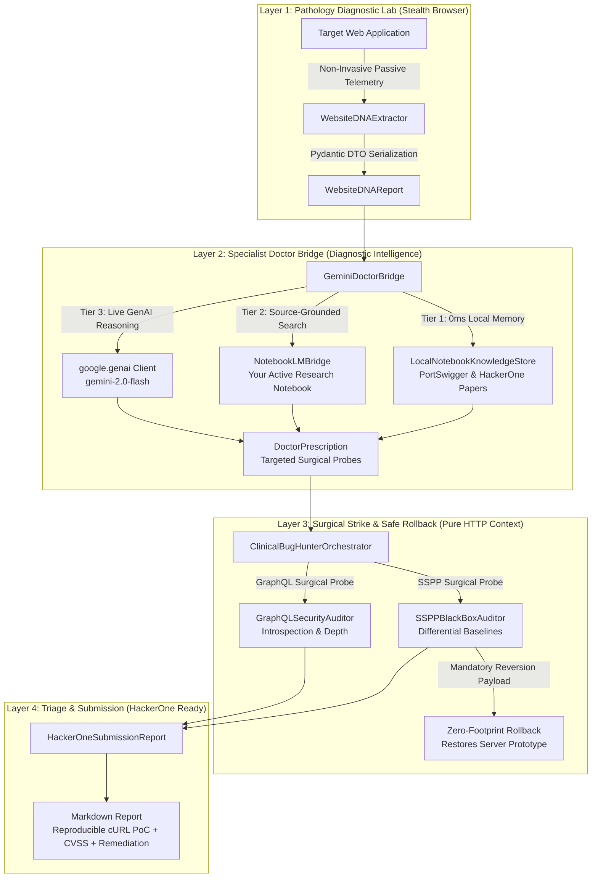

# Behavioral Playwright Security: Clinical Bug Hunter Suite 🩺⚡

[](tests/)
[](behavioral_evasion_suite/)
[](behavioral_evasion_suite/)
[](behavioral_evasion_suite/doctor_bridge.py)
[](behavioral_evasion_suite/clinical_orchestrator.py)

**Behavioral Playwright Security** is a production-grade, stateful autonomous web vulnerability auditing engine. It merges **biomechanical human evasion physics** (bypassing modern anti-bot systems like Cloudflare, DataDome, and Akamai) with a **Clinical Doctor-Patient diagnostic loop** powered by **Google Gemini 2.0 Flash**, **Google NotebookLM**, and curated security research from **PortSwigger Web Security** and **HackerOne**.

---

## 🏛️ The Clinical Bug Hunter Architecture

The engine treats the target web application like a **medical patient**, separating concerns across 4 strictly isolated layers:



---

## 🚀 Key Superpowers

### 1. Full Behavioral Stealth Suite (WAF & Anti-Bot Armor)
Unlike traditional scanners that get blocked within seconds, this framework operates with full behavioral human cloaking:
- **Biomechanical Movement Physics**: 5th-order Bézier curves, jerk minimization, and subpixel mouse trajectory jitter.
- **CDP Evasion & Fingerprint Hardening**: 10-patch cloaking including Canvas shader noise, WebRTC masking, subpixel font variance, and WebAuthn virtual TPM.
- **TLS JA4 Network Stack Spoofing**: Simulates genuine modern Chromium networking fingerprints.

### 2. Clinical Doctor Diagnostic Reasoning
- **Website DNA Extraction**: Non-blocking passive analysis of framework signatures (`Next.js`, `Express`, `Apollo GraphQL`), REST routes, client-side DOM sinks, and WAF immune profiles.
- **Source-Grounded NotebookLM Integration**: Automatically connects to your private Google NotebookLM research notebooks for source-grounded vulnerability analysis.
- **Instant Fallback Local Store**: Offline in-memory database of PortSwigger, OWASP, and HackerOne writeups with zero latency.

### 3. Surgical Non-Destructive Testing & Rollback
- **Differential Baselines**: Validates mutations against standard baselines (eliminating false positives from generic error handlers or HTML redirects).
- **Mandatory Rollback Execution**: Server-side prototype pollution probes are immediately followed by clean reversion payloads (e.g. restoring `json spaces` to `0`, clearing polluted properties) ensuring zero server harm.

### 4. HackerOne Triaged Submission Reports
Automatically exports submission-ready markdown reports complete with:
- Executive Vulnerability Summary
- CVSS Severity Classification
- Copy-paste reproducible cURL Proof of Concept
- Concrete Remediation Instructions
- Verified Non-Destructive Ethical Disclaimers

---

## 🛠️ Quick Start

### Installation

```bash
# Clone the repository
git clone https://github.com/sadik004/behavioral-playwright-security.git
cd behavioral-playwright-security

# Install dependencies
pip install -r requirements.txt
playwright install chromium
```

### Running an Automated Clinical Audit

```python
import asyncio
from behavioral_evasion_suite.clinical_orchestrator import ClinicalBugHunterOrchestrator
from playwright.async_api import async_playwright

async def run():
    async with async_playwright() as p:
        browser = await p.chromium.launch(headless=True)
        page = await browser.new_page()
        
        # Navigate stealthily
        await page.goto("https://api.target.com")

        # Execute Clinical Orchestration
        orchestrator = ClinicalBugHunterOrchestrator()
        results = await orchestrator.execute_clinical_audit(
            request_context=page.request,
            target_url="https://api.target.com",
            page=page
        )
        
        for report in results["hackerone_reports"]:
            print(report["title"])
            print(report["curl_proof_of_concept"])

asyncio.run(run())
```

---

## 🧪 Automated Terminal Quality Gates

Run the complete 23-test test suite:

```bash
pytest tests/test_sspp_auditor.py tests/test_graphql_auditor.py tests/test_clinical_doctor.py -v
```

```text
============================= test session starts =============================
tests/test_sspp_auditor.py (7 passed)
tests/test_graphql_auditor.py (11 passed)
tests/test_clinical_doctor.py (5 passed)

============================= 23 passed in 0.40s ==============================
```

---

## 🛡️ Ethical & Legal Disclosure

This framework is built strictly for authorized security auditing, bug bounty programs adhering to HackerOne/Bugcrowd Safe Harbor policies, and defensive resilience engineering. Never audit targets without explicit written authorization.
