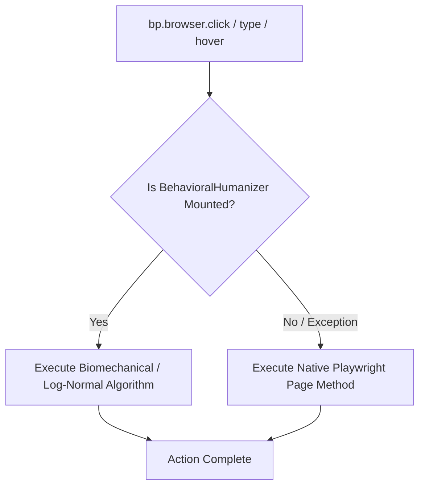

# Browser Architecture & Bio-Emulation

> **Last Verified Against Commit**: `68a3d1e`
> **Status**: [VERIFIED]

---

## 1. Browser Lifecycle & Stealth Context

When `bp.boot()` is called, the framework initializes a Chromium persistent context with advanced CDP evasion shims:

```text
[bp.boot()]
    │
    ▼
[BrowserProviderFactory]
    │
    ▼
[Chromium Launch with Arguments]
    ├── --disable-blink-features=AutomationControlled
    ├── --no-first-run
    └── User Data Directory (Temporary or Persistent)
    │
    ▼
[CDP Init Scripts Injected]
    ├── Object.defineProperty(navigator, 'webdriver', {get: () => undefined})
    ├── window.chrome = { runtime: {} }
    ├── SpeechSynthesis prototype logger
    └── Canvas 2D toDataURL micro-jitter
    │
    ▼
[Viewport Standardized to 1280x720]
```

---

## 2. Dual-Layer Action Dispatching

All browser interaction methods (`click`, `type`, `hover`, `scroll`, `drag_and_drop`, `check`, `press`) implement a dual-layer dispatch architecture:



This guarantees that automation never fails due to missing optional math engines, while providing maximal stealth when humanization components are active.
