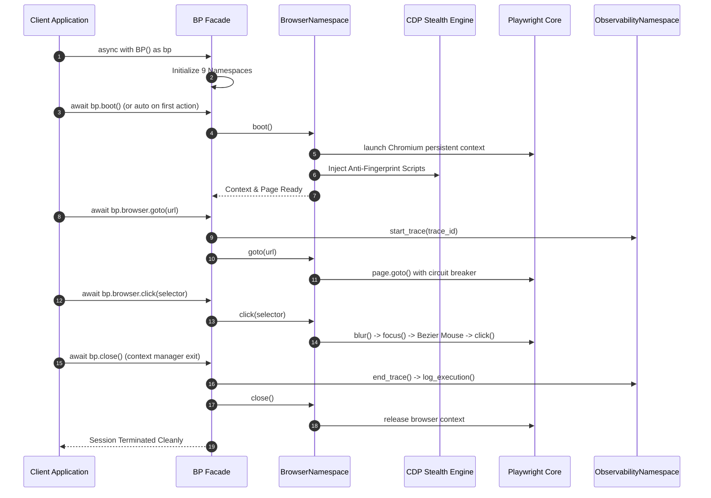

# System Execution Flow

> **Last Verified Against Commit**: `68a3d1e`
> **Status**: [VERIFIED]

---

## 1. Lifecycle Overview

A typical session with Behavioral Playwright follows a structured lifecycle:



---

## 2. Multi-Namespace Data Pipeline Flow

When executing complex extraction workflows (such as crawling, NLP ranking, and webhook dispatching), data transitions across namespaces through structured interfaces:

```text
[Target URL]
     │
     ▼
[bp.network.measure_response_time_async] ──► Checks server latency & health
     │
     ▼
[bp.web.crawl_recursive] ──────────────────► BFS crawl, domain bounds, SQLite session
     │ (Discovered URLs / HTML)
     ▼
[bp.infrastructure.save_to_cache] ─────────► Encrypts & persists raw DOM payloads
     │
     ▼
[bp.ai.re_rank] ───────────────────────────► Multilingual TF-IDF vector space scoring
     │
     ▼
[bp.ai.coerce_data_to_schema] ─────────────► JIT data casting to target schema
     │
     ▼
[bp.observability.log_execution] ──────────► Records performance & success telemetry
     │
     ▼
[bp.integrations.slack_webhook_notify] ────► Dispatches structured alert to Slack/n8n
```
