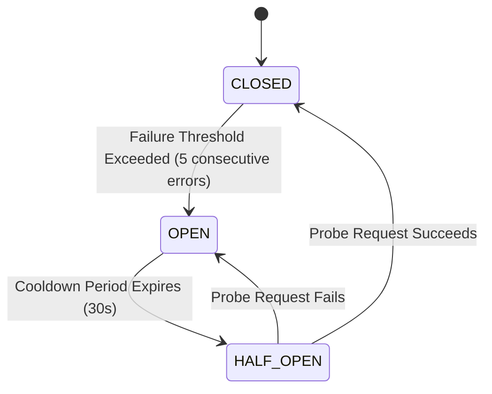

# Navigation & Resilience Engineering

> **Last Verified Against Commit**: `68a3d1e`
> **Status**: [VERIFIED]

---

## 1. 3-State Circuit Breaker

To protect automation jobs from repeated deadlocks when web endpoints fail, the framework implements a strict Circuit Breaker state machine:

---

## 2. Redirection Loop & Trap Detection

When crawling or automating dynamic sites, infinite redirection traps can exhaust memory. [`WebNamespace.detect_redirection_loops`](file:///c:/Users/User/SAA/bp_facade12.py#L350) tracks sliding window URL history and computes entropy and repetition counts, halting navigation when circular redirects are identified.
